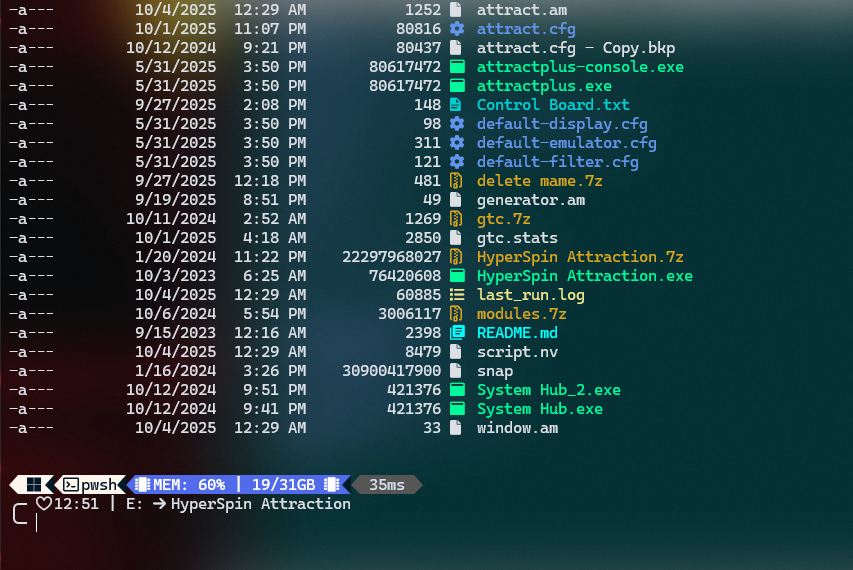
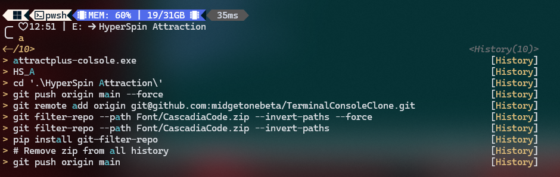
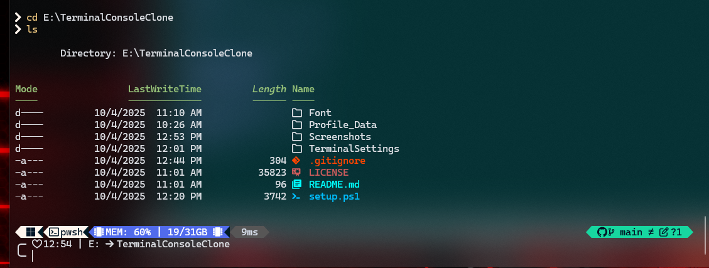

# TerminalConsoleClone


[](https://github.com/midgetonebeta/TerminalConsoleClone/releases/latest)
[](https://github.com/midgetonebeta/TerminalConsoleClone/releases)
[](LICENSE)
[](https://github.com/midgetonebeta/TerminalConsoleClone/stargazers)

Terminal config and install that’s cloned as Perseh from my main setup.

## Troubleshooting

- You need to Run the Setup.ps1 File as Admin.
- Requirements: Windows 10/11, Git installed.
- Run PowerShell as Administrator if fonts fail.

## Features

- Custom PowerShell profile with aliases and functions
- Oh My Posh theme (`midgetsrampage.omp.json`)
- Auto-install PowerShell 7, fonts, and terminal settings
- Fonts: CascadiaCode Nerd Font
- Easy setup with `setup.ps1`

## 📸 Screenshots

### File Tree



### Running Setup



### Final Look



---

## 📂 Contents

- `Profile_Data/` → PowerShell profile + Oh My Posh theme
- `Font/` → CascadiaCove Nerd Font TTFs
- `TerminalSettings/` → Windows Terminal settings JSON
- `Screenshots/` → Preview images for this README
- `setup.ps1` → Automates setup (fonts, modules, profile, settings)

---

## ⚡ Installation

Clone this repository and run the setup:

```powershell
git clone https://github.com/midgetonebeta/TerminalConsoleClone.git
cd TerminalConsoleClone
.\setup.ps1
```
